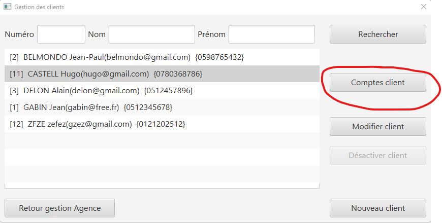
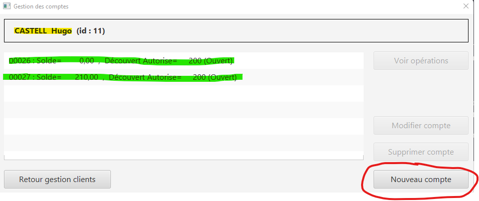
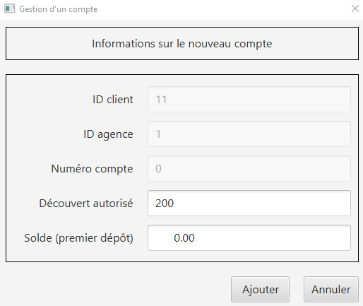
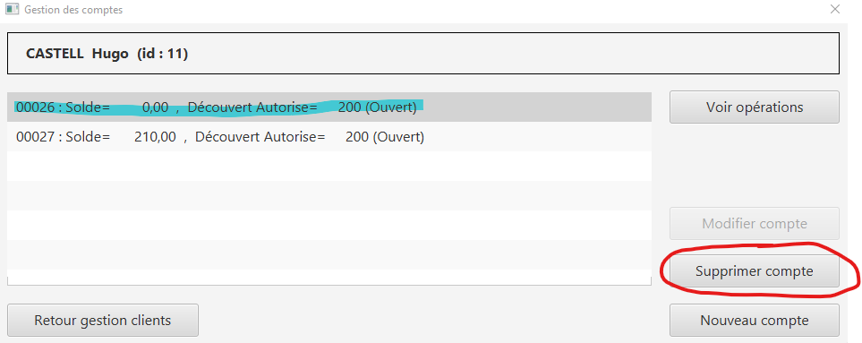
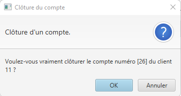

= *Documentation*
Créer et clôturer un compte
Rédigé par Gabin Munoz

== Création d'un compte ==
=== Documentation utilisateur ===

Un client peut posséder plusieurs comptes en banque. En tant que guichetier ou chef d'agence, vous poiuvez aisément créer un nouveau compte pour un client via le panneau d'administration de celui-ci. Pour ce faire, suivez les étapes décrites ci-dessous. 

===== Étape 1 =====
Pour accéder à la gestion des comptes de client, accédez à votre panel client. Sélectionnez ensuite le client à qui vous voulez ajouter un compte, puis cliquez sur le bouton "Comptes client" dans le panneau latéral droit. 

===== Étape 2 =====

Vous pouvez maintenant voir tous les comptes du client concerné, avec diverses informations telles que : 

** Le nom du client actuel, ainsi que son identifiant (en jaune)
** Tous les comptes du client avec dans l'ordre : (en vert)
*** Le numéro du compte
*** Le solde actuel
*** Le découvert autorisé

Pour créer un nouveau compte, cliquez sur le bouton "Nouveau compte" sur le panneau latéral droit. 

===== Étape 3 =====

Renseignez maintenant les paramètres associés au nouveau compte que vous souhaitez créer, et validez les modifications une fois terminé. 

Paramètres disponibles : 

** Découvert autorisé (le découvert maximal autorisé pour ce compte)
** Solde (Le solde de départ du compte client)

*Les autres paramètres ne sont pas modifiables pour un guichetier, car ils sont automatiquements générés*

=== Fonctionnement technique (développeurs) ===

Lors du clic sur le bouton de création du nouveau compte, plusieurs procédures sont appellées. 

==== creerCompte ====

On récupère d'abord les données des inputs de la fenêtre d'ajout. Est ensuite appellée une méthode de création du client nommée 'creerCompte'. C'est une méthode de l'objet CompteCourant.

==== AccessCompteCourant ====

Cette méthode, après vérification de quelques exexptions appelle AccessCompteCourant dans l'objectif de faire appel aux méthodes de mofification de la base de données. 

==== insertCompte ====

AccesCompteCourant possède la méthode insertCompte, son objectif est de rajouter un compte dans la BDD avec les paramètres passés.

== Clôture d'un compte ==

=== Documentation utilisateur ===

Un client peut posséder plusieurs comptes en banque. En tant que guichetier ou chef d'agence, vous pouvez aisément clôturer un compte pour un client via le panneau d'administration de celui-ci. Cela aura pour effet de le définir comme 'clôturé' dans la base de données. Celui-ci sera toujours visible, mais ne sera plus administrable. 
Pour clôturer un compte, suivez les étapes décrites ci-dessous. 

===== Étape 1 =====
Pour accéder à la gestion des comptes de client, accédez à votre panel client. Sélectionnez ensuite le client à qui vous voulez clôturer un compte, puis cliquez sur le bouton "Comptes client" dans le panneau latéral droit. 

===== Étape 2 =====

Vous pouvez maintenant voir tous les comptes du client concerné, avec diverses informations telles que : 

** Le nom du client actuel, ainsi que son identifiant (en jaune)
** Tous les comptes du client avec dans l'ordre : (en vert)
*** Le numéro du compte
*** Le solde actuel
*** Le découvert autorisé

Pour clôturer un compte, commencez par le sélectionner dans le panel (en bleu ci dessous). Le bouton "Supprimer le compte" sera alors disponible (entouré en rouge ci-dessous).

Cliquez dessus, un message de confirmation vous demandera de valider l'action.

Confirmez. Vous reviendrez alors sur l'écran précédent, où vous remarquerez que le compte précédemment sélectionné est maintenant clôturé. Félicitation !

=== Fonctionnement technique (développeurs) ===

Lors du clic sur le bouton de clôture du nouveau compte, plusieurs procédures sont appellées. 

==== supprCompte ====

On récupère les informations du compte que l'on souhaite supprimer, et on les envoie à AccessCompteCourant.

==== AccessCompteCourant ====

Cette méthode, après vérification de quelques exeptions appelle AccessCompteCourant dans l'objectif de faire appel aux méthodes de mofification de la base de données. 

==== clotCompte ====

AccesCompteCourant possède la méthode clotCompte.

Cela a pour effet de définir le compte actuellement sélectionné comme "estCloture" dans la BDD.
