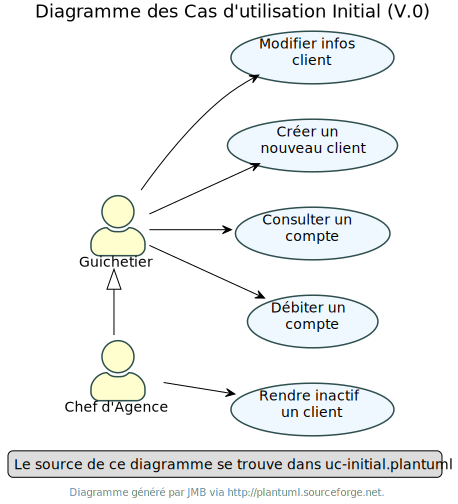

:stylesheet: CDCU.css

= CAHIER DES CHARGES
Hugo CASTELL - Gabin MUNOZ - Matéo PEPIN
v1.0 {localdate}
:nofooter:
:toc: left

== 1. Présentation du sujet ==

=== 1.1. Contexte ===
La banque DailyBank souhaite développer une application JAVA-Oracle de gestion des comptes clients pour remplacer plusieurs outils obsolètes. Ce développement s’inscrit dans le cadre de la restructuration de ses services bancaires et l’application sera déployée dans les 100 agences que compte son réseau. Vous travaillerez à partir d’une application existante « Daily Bank » qu’il faudra adapter aux nouveaux besoins de la banque. +

Dans le cadre universitaire, la SAE 2.01 Développement d'application met en oeuvre les compétences de gestion de projet, de développement algorithmique, de gestion de base de données et de développement d'interface IHM des élèves. +

Les outils utilisés seront : +

** Github : Flexibilité de gestion grâce au versionning et aux issues/milestones
** Discord : Communication instantanée et channels vocaux
** VSCode ou Eclipse pour le développement
** Google / MS Project (?) pour la gestion de projet

NOTE: Nous travaillons l'essentiel du temps hors des séances dédiées pour accélérer le rythme de production des documentations et du code. 

Notre équipe est composée d'un chef de projet, Gabin MUNOZ, et de deux autres membres, Hugo CASTELL et Matéo PEPIN. +

=== 1.2. Objectifs ===
L’application doit permettre de gérer des comptes bancaires de dépôt pour des clients préalablement créés. Elle devra permettre de débiter, créditer un compte soit par virement c’est à dire un échange d’argent entre deux comptes distincts mais domiciliés dans le réseau bancaire, soit par une personne physique se présentant devant un guichet. +

Nous produirons des documentations portant sur la gestion du projet mais aussi de la documentation technique et dédiée à l'utilisateur. +

Toutes les documentations seront disponibles sur Github dans un dossier prévu à cet effet.

== 2. Analyse de l'existant ==
Dans la version existante, le guichetier peut : 
- Modifier une information client
- Créer un nouveau client
** Consulter un compte
** Débiter un compte

Et le chef d'agence peut :
** Rendre inactif un client

De plus, il existe déjà le diagramme des UC de la version initiale. 

L'application existante, développée en JAVA, possède déjà une interface graphique. +

La base de données est déjà implémentée. +

L'utilisateur peut être d'un des status suivants : guichetier ou chef d'agence. +

[#img-sunset]
.Diagramme des cas d'utilisations

== 3. Analyse des besoins ==
En partant de la version initiale, les éléments à ajouter sont les suivants :

== 4. Analyse des contraintes ==

=== 4.1. Analyse des contraintes ===
