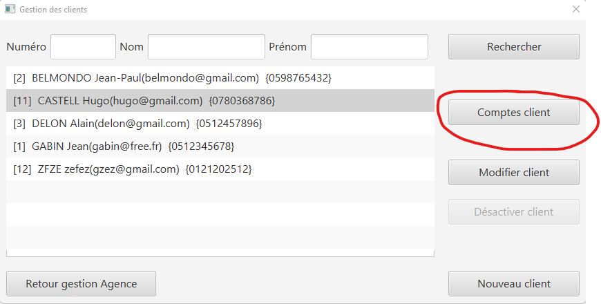
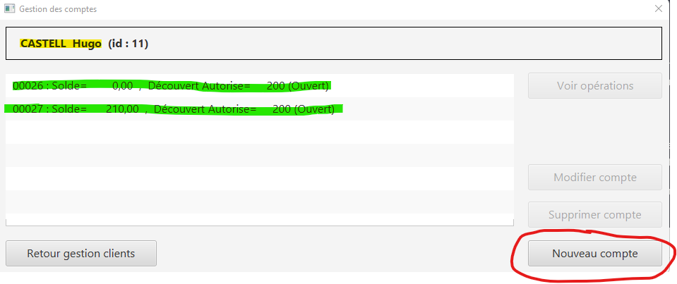
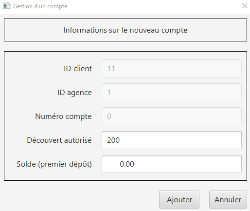
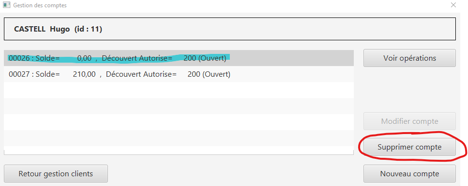
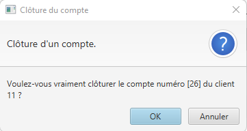
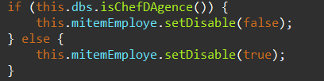
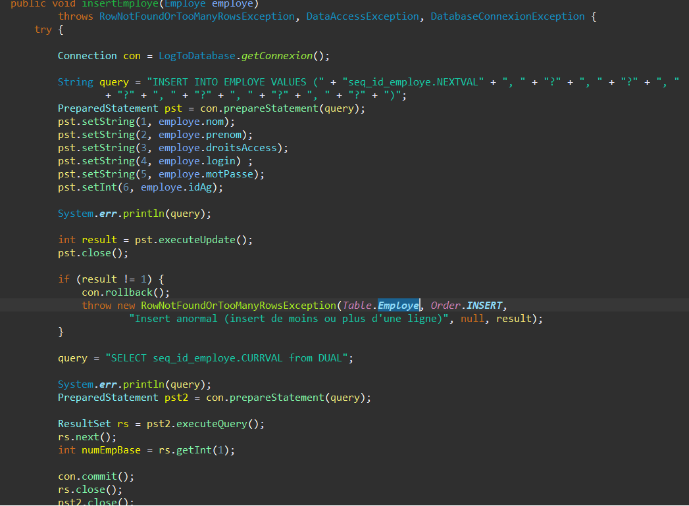

:stylesheet: doc.css

= *DOCUMENTATION TECHNIQUE*
Hugo CASTELL, Pépin Matéo, Gabin Munoz
v1.0 {localdate}
:nofooter:
:toc: left
:toc-title: Sommaire

== Remarques et documents annexes ==

.*Remarques*
Cette documentation technique est menée à être mise à jour ultérieurement. +
Les informations qu'elle contient peuvent ne pas à être valables à l'heure où vous consultez le document.

.*Documents annexes*
Si vous n'êtes pas sur le bon document, voici un tableau des documents disponibles. +

[%header, format=csv]
|===
Nom du document, Lien
|===

== Présentation de l'application ==

L'application DailyBank, une application Java-ORACLE est un logiciel de gestion d'agences bancaires. Entre-autre, il permet la gestion des employés et des clients par le chef d'agence. Le guichetier quant à lui peut gérer les comptes clients, s'occuper de lur clôture, ouverture, et des actions diverses dessus -> débit/crédit/virement.

L'application se décompose en deux parties distinctes : +
Une application JAVA qui sert d'interface en relation avec une base de données.

=== Application JAVA ===

=== Base de données : ORACLE ===

==== Justification du choix de la technologie ====

La base de données utilise une structure _relationnelle_. +
Nous avons choisi cette technologie pour deux avantages de développement : +

* L'utilisation de la librairie JDBC
* La necessité de stocker des opérations :
** Il sera plus simple de parcourir les opérations grâce à SQL plutôt qu'avec une base NoSQL comme CassandraDB ou MongoDB
* Stabilité de la technologie car venant d'ORACLE
* Très documenté

==== Schéma Logique ====

[%header, format=dsv]
|===
Table: Attributs
AGENCEBANCAIRE: ([underline]#idAg#, nomAg, adressePostaleAg, idEmployeChefAg#)
ASSURANCEEMPRUNT: ([underline]#idAss#, tauxAss, tauxCouv, idEmprunt#)
CLIENT: ([underline]#idNumClient#, nom, prenom, adressePostale, email, telephone, estInactif, idAg#)
COMPTECOURANT: ([underline]#idNumCompte#, debitAutorise, solde, idNumCli#, estCloture)
EMPLOYE: ([underline]#idEmploye#, nom, prenom, droitsAccess, login, motPasse, idAg#)
EMPRUNT: ([underline]#idEmprunt#, tauxEmp, capitalEmp, dureeEmp, dateDebEmp, idNumCli#)
OPERATION: ([underline]#idOperation#, montant, dateOp, dateValeur, idNumCompte#, idTypeOp#)
PRELEVEMENTAUTOMATIQUE: ([underline]#idPrelev#, montant, dateRecurrente, beneficiaire, idNumCompte#)
TYPEOPERATION: ([underline]#idTypeOp#)
|===
Auteur : _Hugo CASTELL_

==== Rappel de sécurité ====

.*Contraintes juridiques*

Nous manipulons des données personnelles, plus précisement des données bancaires. +
*Le RGPD s'applique donc.* +

.*Utilisation dans un programme JAVA*

Les données doivent être manipulées dans des classes qui assurent leur intégrité. +
Pour cela, aucune donnée ne doit transiter : +

* Dans un attribut instancié en _public_
* Dans une sortie standard
* Dans une exception
* Si elle n'est pas adressée à une personne compétente pour la recevoir (Limiter l'accès aux données en fonction du statut dans l'entreprise de l'utilisateur)

Auteur : _Hugo CASTELL_

== Installation de l'application ==

Si vous souhaitez installer l'application DailyBank sur votre machine, suivez le tutoriel ci-dessous. 

=== Téléchargement === 
[.underline]#Téléchargement et installation de Java# +

Pour pouvoir utiliser l'application, vous devez avoir Java **8** d'installé sur votre machine. Pour l'installer, vous pouvez suivre le lien officiel Java : https://www.java.com/fr/download/manual.jsp

[.underline]#Téléchargement et installation de DailyBank# +
Vous pouvez suivre ce lien pour télécharger le .jar du logiciel DailyBank. +
https://dailybank.fr/download

=== Lancement du .jar ===

Une fois le téléchargement terminé, rendez-vous dans le dossier de téléchargement du .jar. Pour ouvrir le jar. +

Vérifiez que la variable d'environnement PATH du compte est bien situé sur le bin du java_8. +

Dans une invite de commande, utilisez cette commande pour vérifier la version de Java : +

[source,shell]
----
java --version
----

Une fois cela fait, vous pouvez utiliser cette commande pour lancer le jar :

[source,shell]
----
java -jar DailyBank.jar
----

Auteurs : _Hugo CASTELL et Gabin MUNOZ_

== Architecture de l'application ==

-> Hugo, à continuer ici en mettant : 

 *   Architecture générale (poste client, serveurs, …) et rôle de chaque élément

 *   Ressources externes (.jar, …) utilisées et rôles

 *   Structuration en packages de l’application documentée. Principes retenus pour cette structuration

 *   Eléments essentiels à connaître, spécificités, … nécessaires à la mise en œuvre du développement. Cette partie peut être illustrée par un diagramme de séquence

L'application est conçu selon le principe MCV (_Model View Controller_). +
Ainsi toute l'application se structure autour :

* Modèle : Base de données ORACLE
* Vue : Interface graphique JAVAFX
* Contrôleur : Fonctionnalités de l'application JAVA

=== Structure des paquets ===

Paquets du _Modèle_ :
****
model.data : Contient les classes de données.

model.orm : Contient les classes de gestion des données.

model.orm.exception : Contient les classes d’exceptions.
****
Paquets de la _Vue_ : 
****
application.view : Contient les classes de l’interface graphique
****
Paquets du _Contrôleur_ : 
****
application.tools : Contient contenant les outils de l’application.

application.control : Contient les fonctionnalités de l’application
****

== Implémentation ==

=== Répartition des fonctionnalités par programmeur ===
Afin d'avoir un travail le plus productif possible, nous avons distribué les fonctionnalités à implémenter à chaque programmeur. Retrouvez ci-dessous la répartition du développement des fonctionnalités :

[%header, format=dsv]
|===
Fonctionnalité à implémenter : Développeur
Création, Lecture, Modification, Suppression, (CRUD)  : Matéo Pépin
Virement de compte à compte, créditer/débiter un compte : Hugo Castell
Créer et clôturer un compte : Gabin Munoz
|===

=== Crédit / Débit d'un compte ===

Référent : _Hugo CASTELL_ +

Débiter et créditer un compte fonctionnent selon des procédures stockées dans la base de données. +
Elles prennent en paramètre

=== Virement compte-à-compte ===

Référent : _Hugo CASTELL_ +

=== Création / Clôture d'un compte ===

Référent : _Gabin MUNOZ_ +

==== Documentation utilisateur ====

Un client peut posséder plusieurs comptes en banque. En tant que guichetier ou chef d'agence, vous poiuvez aisément créer un nouveau compte pour un client via le panneau d'administration de celui-ci. Pour ce faire, suivez les étapes décrites ci-dessous. 

===== Étape 1 =====
Pour accéder à la gestion des comptes de client, accédez à votre panel client. Sélectionnez ensuite le client à qui vous voulez ajouter un compte, puis cliquez sur le bouton "Comptes client" dans le panneau latéral droit. 

===== Étape 2 =====

Vous pouvez maintenant voir tous les comptes du client concerné, avec diverses informations telles que : 

** Le nom du client actuel, ainsi que son identifiant (en jaune)
** Tous les comptes du client avec dans l'ordre : (en vert)
*** Le numéro du compte
*** Le solde actuel
*** Le découvert autorisé

Pour créer un nouveau compte, cliquez sur le bouton "Nouveau compte" sur le panneau latéral droit. 

===== Étape 3 =====

Renseignez maintenant les paramètres associés au nouveau compte que vous souhaitez créer, et validez les modifications une fois terminé. 

Paramètres disponibles : 

** Découvert autorisé (le découvert maximal autorisé pour ce compte)
** Solde (Le solde de départ du compte client)

*Les autres paramètres ne sont pas modifiables pour un guichetier, car ils sont automatiquements générés*

=== Fonctionnement technique (développeurs) ===

Lors du clic sur le bouton de création du nouveau compte, plusieurs procédures sont appellées. 

==== creerCompte ====

On récupère d'abord les données des inputs de la fenêtre d'ajout. Est ensuite appellée une méthode de création du client nommée 'creerCompte'. C'est une méthode de l'objet CompteCourant.

---
_CompteManagement.java_
[source, java]
----
/**
	 * Méthode de création du compte, se lance lors du clic sur 'créer un compte'
	 * @return
	 */
	public CompteCourant creerCompte() {
		CompteCourant compte;
		CompteEditorPane cep = new CompteEditorPane(this.primaryStage, this.dbs);
		compte = cep.doCompteEditorDialog(this.clientDesComptes, null, EditionMode.CREATION);
		if (compte != null) {
			try {
				
				// enregistrement du nouveau compte en BDD
				AccessCompteCourant acc = new AccessCompteCourant();
				
				acc.insertCompte(compte);

				if (Math.random() < -1) {
					throw new ApplicationException(Table.CompteCourant, Order.INSERT, "todo : test exceptions", null);
				}
			} catch (DatabaseConnexionException e) {
				ExceptionDialog ed = new ExceptionDialog(this.primaryStage, this.dbs, e);
				ed.doExceptionDialog();
				this.primaryStage.close();
			} catch (ApplicationException ae) {
				ExceptionDialog ed = new ExceptionDialog(this.primaryStage, this.dbs, ae);
				ed.doExceptionDialog();
			}
		}
		return compte;
	}
----
---

==== AccessCompteCourant ====

Cette méthode, après vérification de quelques exeptions appelle AccessCompteCourant dans l'objectif de faire appel aux méthodes de mofification de la base de données. 

==== insertCompte ====

AccesCompteCourant possède la méthode insertCompte, son objectif est de rajouter un compte dans la BDD avec les paramètres passés.

---
_AccessCompteCourant.java_
[source, java]
----
/**
	 * Insertion d'un compte courant.
	 * Création d'un nouveau compte courant
	 *
	 * @param CompteCourant compte
	 */
	public void insertCompte(CompteCourant compte)
			throws RowNotFoundOrTooManyRowsException, DataAccessException, DatabaseConnexionException {
		try {

			Connection con = LogToDatabase.getConnexion();

			String query = "INSERT INTO COMPTECOURANT VALUES (" + "seq_id_compte.NEXTVAL" + ", "	+ "?" + ", " + "?" + ", " + "?" + ", " + "?" + ")";
			PreparedStatement pst = con.prepareStatement(query);
			pst.setInt(1, compte.debitAutorise); // ajout du debitAutorise du comtpe dans la requête
			pst.setDouble(2, compte.solde); // ajout du solde du comtpe dans la requête
			pst.setInt(3, compte.idNumCli); // ajout du idNumCli du client du comtpe dans la requête
			pst.setString(4, compte.estCloture);
 

			System.err.println(query);

			int result = pst.executeUpdate();
			pst.close();

			if (result != 1) {
				con.rollback();
				throw new RowNotFoundOrTooManyRowsException(Table.CompteCourant, Order.INSERT,
						"Insert anormal (insert de moins ou plus d'une ligne)", null, result);
			}

			query = "SELECT seq_id_compte.CURRVAL from DUAL";

			System.err.println(query);
			PreparedStatement pst2 = con.prepareStatement(query);

			ResultSet rs = pst2.executeQuery();
			rs.next();
			//int numCliBase = rs.getInt(1);

			con.commit();
			rs.close();
			pst2.close();

			// client.idNumCli = numCliBase;
		} catch (SQLException e) {
			throw new DataAccessException(Table.CompteCourant, Order.INSERT, "Erreur accès", e);
		}
	}
----

Dans cette méthode, on rédige une requête SQL d'INSERT dans la table, passe en paramètre les éléments à INSERT et envoie la requête. 

Cela a pour effet de créer un nouveau compte dans la BDD.

== Clôture d'un compte ==

=== Documentation utilisateur ===

Un client peut posséder plusieurs comptes en banque. En tant que guichetier ou chef d'agence, vous pouvez aisément clôturer un compte pour un client via le panneau d'administration de celui-ci. Cela aura pour effet de le définir comme 'clôturé' dans la base de données. Celui-ci sera toujours visible, mais ne sera plus administrable. 
Pour clôturer un compte, suivez les étapes décrites ci-dessous. 

==== Étape 1 ====
Pour accéder à la gestion des comptes de client, accédez à votre panel client. Sélectionnez ensuite le client à qui vous voulez clôturer un compte, puis cliquez sur le bouton "Comptes client" dans le panneau latéral droit. 

===== Étape 2 =====

Vous pouvez maintenant voir tous les comptes du client concerné, avec diverses informations telles que : 

** Le nom du client actuel, ainsi que son identifiant (en jaune)
** Tous les comptes du client avec dans l'ordre : (en vert)
*** Le numéro du compte
*** Le solde actuel
*** Le découvert autorisé

Pour clôturer un compte, commencez par le sélectionner dans le panel (en bleu ci dessous). Le bouton "Supprimer le compte" sera alors disponible (entouré en rouge ci-dessous).

Cliquez dessus, un message de confirmation vous demandera de valider l'action.

Confirmez. Vous reviendrez alors sur l'écran précédent, où vous remarquerez que le compte précédemment sélectionné est maintenant clôturé. Félicitation !

=== Fonctionnement technique (développeurs) ===

Lors du clic sur le bouton de clôture du nouveau compte, plusieurs procédures sont appellées. 

Premièrement, _doSupprimerCompte_ est appellé lors du clic sur le bouton de clôture de compte. C'est cette procédure qui entame la chemin de suppression de compte. 

---
_ComptesManagementController.java_
[source,java]
----
@FXML
	private void doSupprimerCompte() {
		// on récupère l'indice actuel
		int selectedIndice = this.lvComptes.getSelectionModel().getSelectedIndex();
		// on récupère le numéro du compte associé à l'indice
		this.cm.supprCompte(this.olCompteCourant.get(selectedIndice));
	}
----
---

Pour ce faire, on récupère l'indice du compte sélectionné sur la liste intéractive. Puis on récupère le numéro du compte associé à l'indice, et on le passe en paramètre à la méthode _supprCompte_ ci-dessous : +

---
_ComptesManagement.java_
[source, java]
----
/**
	 * Méthode de suppression du compte, se lance lors du clic sur 'supprimer un compte'
	 * @param compteCourant 
	 * @return
	 */
	public CompteCourant supprCompte(CompteCourant compte) {
		boolean suppr;
		// création d'un new pane à la suite de l'action
		CompteEditorPane cep = new CompteEditorPane(this.primaryStage, this.dbs);
		//
		//compte = cep.doCompteEditorDialog(this.clientDesComptes, null, EditionMode.SUPPRESSION);
		
		// affichage de l'alerte
		Alert alert = new Alert(Alert.AlertType.CONFIRMATION);
		alert.setTitle("Clôture du compte");
		alert.setHeaderText("Clôture d'un compte.");
		alert.setResizable(false);
		alert.setContentText("Voulez-vous vraiment clôturer le compte numéro [" + compte.idNumCompte + "] du client " + compte.idNumCli + " ?");

		Optional<ButtonType> result = alert.showAndWait();
		ButtonType button = result.orElse(ButtonType.CANCEL);

		if (button == ButtonType.OK) {
		    System.out.println("Ok cloture");
		    suppr = true;
		} 
		else if (button == ButtonType.CANCEL) {
		    System.out.println("Annulation");
		    suppr = false;
		}
		else {
		    System.out.println("Annulation");
		    suppr = false;
		}
		
		// on fait l'OP sur la BD en conséquence 
		if (suppr == true) {
			try {
				
				// enregistrement du nouveau compte en BDD
				AccessCompteCourant acc = new AccessCompteCourant();
				
				acc.clotCompte(compte.idNumCompte);

				if (Math.random() < -1) {
					throw new ApplicationException(Table.CompteCourant, Order.INSERT, "todo : test exceptions", null);
				}
			} catch (DatabaseConnexionException e) {
				ExceptionDialog ed = new ExceptionDialog(this.primaryStage, this.dbs, e);
				ed.doExceptionDialog();
				this.primaryStage.close();
			} catch (ApplicationException ae) {
				ExceptionDialog ed = new ExceptionDialog(this.primaryStage, this.dbs, ae);
				ed.doExceptionDialog();
			}
		}
		return compte;
	}
----
---

Cette méthode affiche une nouvelle fenêtre qui est une Alert de type Confirmation. Celle-ci demande confirmation à l'utilisateur de la suppression du compte sélectionné, et change un booleen en conséquence. +
En fonction du booléen, l'opération est effectuée dans la BD avec l'appel de _AccessCompteCOurant_ qui régit toutes le manips sur la BDD.

AccesCompteCourant possède la méthode clotCompte.

---
_AccessCompteCourant.java_
[source, java]
----
/**
	 * Cloture d'un compte courant.
	 * Création d'un nouveau compte courant
	 *
	 * @param CompteCourant compte
	 */
	public void clotCompte(int numcompte)
			throws RowNotFoundOrTooManyRowsException, DataAccessException, DatabaseConnexionException {
		try {

			Connection con = LogToDatabase.getConnexion();

			// déclaration de la requête SQL
			String query = "UPDATE COMPTECOURANT SET ESTCLOTURE = 'O' WHERE IDNUMCOMPTE = " + "?";;
			// préparation de la requête avec les pramètres
			PreparedStatement pst = con.prepareStatement(query); 
			// ajout des paramètres à la requête
			pst.setInt(1, numcompte);
			System.out.println("Requête crée : " + pst);

			int result = pst.executeUpdate();
			pst.close();

			if (result != 1) {
				con.rollback();
				throw new RowNotFoundOrTooManyRowsException(Table.CompteCourant, Order.UPDATE,
						"Delete anormal (insert de moins ou plus d'une ligne)", null, result);
			}

			//query = "SELECT seq_id_compte.CURRVAL from DUAL";

			//System.err.println(query);
			//PreparedStatement pst2 = con.prepareStatement(query);

			//ResultSet rs = pst2.executeQuery();
			//rs.next();
			//int numCliBase = rs.getInt(1);

			con.commit();
			//rs.close();
			//pst2.close();

			// client.idNumCli = numCliBase;
		} catch (SQLException e) {
			throw new DataAccessException(Table.CompteCourant, Order.UPDATE, "Erreur accès", e);
		}
	}
----

Dans cette méthode, on rédige une requête SQL de modification de table, passe en paramètre le numéro de compte, modifie sa colonne 'EstCloture' et envoie la requête. 

Cela a pour effet de définir le compte actuellement sélectionné comme "estCloture" dans la BDD. +

=== Chef d'agences : CRUD ===

Référent : _Matéo PEPIN_ + +

Cette fonctionnalité consistait à donner la possibilité aux chefs d'agence de créer, lire, modifier et supprimer des emploés de la base de donée. Pour cela, j'ai ajouté 2 fenêtres très similaires à celle utilisée pour créer des comptes, ces fenêtres sont accessible seulement par les chefs d'agence car le bouton est désactivé pour les guichetiers. +

Dans la première page, celle qui s'ouvre depuis le menu principal, un bouton "Rechercher" fait, comme pour les comptes un appel à la méthode "rechercher" qui interroge la base de donées afin de récupérer la liste des employes et leurs informations dans la base de données (processus effectué dans la classe "model.orm.AccessEmploye"). +

On peut également supprimer un employé de la liste, ce qui a également pour effet de le supprimer de la base de données (processus smilaire à la recherche). +

La deuxième page est ouverte avec la méthode "nouvel employe", appelée par les boutons "créer employé" et "modifier employé" qui ouvre une nouvelle fenêtre javaFX. Elle est très semblable à celle des comptes que ce soit en fonctionnement ou en apparence, elle permet d'ajouter un nouvel employe ou d'en modifier un existant. +

